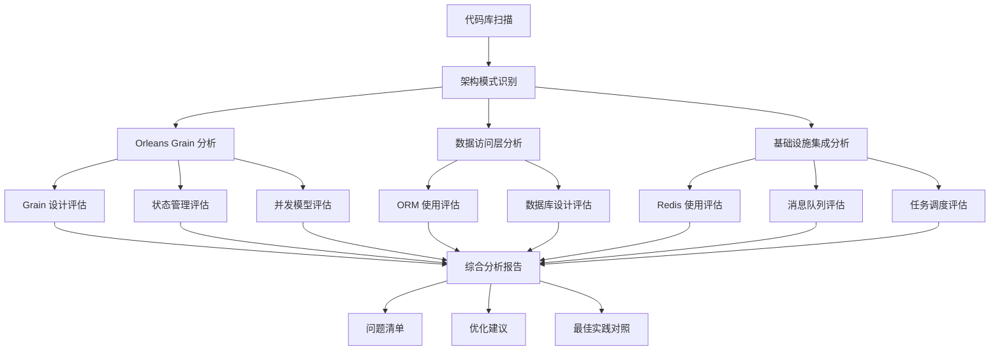
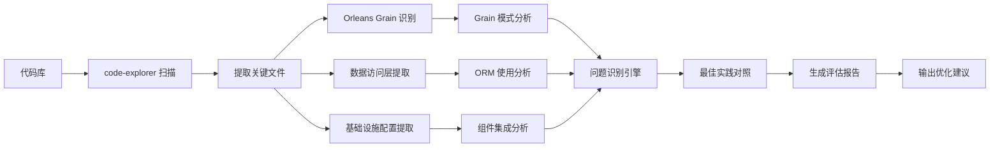

## 产品概述

对基于 Microsoft Orleans、SqlSugar ORM 和 PostgreSQL 的微服务架构项目进行全面深入的技术分析评估。本分析将独立评估系统的架构设计合理性、技术栈选型适配度、Orleans 最佳实践遵循情况、潜在技术债务和性能瓶颈,并提供可执行的优化建议。

## 核心功能

- **架构设计评估**: 分析 Orleans Grain 设计模式、服务边界划分、Actor 模型应用合理性
- **技术栈适配度分析**: 评估 SqlSugar + PostgreSQL 在 Orleans 场景下的使用是否合理,以及 Redis、Hangfire、CAP、MongoDB 等组件的集成方式
- **最佳实践符合度检查**: 对照 Orleans 官方推荐的架构模式、状态管理、集群配置、持久化策略进行对比
- **代码质量与性能评估**: 识别潜在的性能瓶颈、资源泄漏风险、并发问题、数据一致性隐患
- **可扩展性与可维护性分析**: 评估系统的横向扩展能力、服务治理成熟度、监控体系完善度
- **优化建议报告**: 提供分层次的改进方案,包括架构优化、代码重构、性能调优、运维改进等维度

## 技术栈

- **分析工具**: 代码静态分析 + 架构模式识别
- **评估框架**: Orleans 最佳实践对照 + 微服务成熟度模型
- **输出格式**: Markdown 结构化报告 + Mermaid 架构图

## 技术架构

### 系统架构

采用多维度分析方法,从代码层、架构层、运维层三个视角进行全面评估:



### 模块划分

#### Orleans 架构评估模块

- **职责**: 分析 Grain 设计、集群配置、持久化策略
- **关键技术**: Orleans 框架模式识别、Silo 配置分析
- **依赖**: code-explorer 子代理进行代码库扫描

#### 数据层评估模块

- **职责**: 评估 SqlSugar ORM 使用方式、PostgreSQL 数据库设计、事务管理
- **关键技术**: ORM 反模式识别、SQL 性能分析
- **依赖**: 数据访问代码分析

#### 基础设施集成评估模块

- **职责**: 分析 Redis、Hangfire、CAP、MongoDB 的集成合理性和使用效率
- **关键技术**: 组件集成模式分析、资源使用评估
- **依赖**: 配置文件和集成代码分析

### 数据流



## 实现细节

### 核心目录结构

```
analysis-output/
├── architecture-overview.md      # 整体架构概览
├── orleans-analysis.md           # Orleans 架构专项分析
├── data-layer-analysis.md        # 数据层分析
├── infrastructure-analysis.md    # 基础设施分析
├── issues-catalog.md             # 问题清单
├── optimization-roadmap.md       # 优化路线图
└── diagrams/                     # Mermaid 架构图集
```

### 关键分析维度

#### Orleans 架构分析

**问题陈述**: 评估 Orleans Grain 设计是否符合 Actor 模型最佳实践,状态管理是否合理

**解决方案**:

1. 扫描所有 Grain 实现类,检查是否正确继承接口
2. 分析 Grain 之间的依赖关系,识别循环依赖和过度耦合
3. 检查状态持久化策略 (Storage Provider 配置)
4. 评估 Grain 激活/失活策略是否优化

**关键技术**:

- Orleans Grain 生命周期分析
- Actor 模型反模式识别
- 集群配置最佳实践对照

**实施步骤**:

1. 使用 code-explorer 扫描所有 Grain 类和接口
2. 提取 Grain 调用关系,绘制依赖图
3. 分析 Grain 状态管理代码,识别潜在内存泄漏
4. 检查 Silo 配置和集群拓扑设计
5. 对照 Orleans 官方最佳实践文档,生成符合度报告

**测试策略**: 通过代码模式匹配验证分析结果的准确性

#### 数据访问层分析

**问题陈述**: 评估 SqlSugar ORM 在 Orleans 异步编程模型下的使用是否得当

**解决方案**:

1. 检查是否存在同步数据库调用阻塞 Grain
2. 分析事务管理策略,识别分布式事务问题
3. 评估 N+1 查询问题和 ORM 性能陷阱
4. 检查数据库连接池配置和资源管理

**关键技术**:

- ORM 反模式检测
- PostgreSQL 性能分析
- 异步编程模式验证

**实施步骤**:

1. 提取所有数据访问代码
2. 识别同步调用和阻塞操作
3. 分析事务边界和隔离级别设置
4. 检查查询性能和索引使用
5. 生成数据层优化建议

#### 基础设施集成分析

**问题陈述**: 评估 Redis、Hangfire、CAP、MongoDB 等组件的集成是否合理

**解决方案**:

1. 分析 Redis 使用场景 (缓存 vs 持久化 vs 分布式锁)
2. 评估 Hangfire 任务调度设计和执行效率
3. 检查 CAP 事件总线使用和消息可靠性保障
4. 分析 MongoDB 使用场景和数据模型设计

**关键技术**:

- 分布式缓存模式分析
- 消息驱动架构评估
- 任务调度最佳实践

**实施步骤**:

1. 扫描各组件的配置和使用代码
2. 识别不当使用模式和性能瓶颈
3. 评估组件间的协作关系
4. 生成基础设施优化建议

### 集成点

- **代码库扫描**: 通过 code-explorer 子代理深度遍历项目文件
- **模式识别**: 基于正则表达式和语法树分析提取关键代码模式
- **报告生成**: 输出 Markdown 格式的结构化分析报告和 Mermaid 架构图

## 技术考量

### 性能优化

- **瓶颈识别**: 通过代码模式识别潜在的性能热点 (同步调用、锁竞争、大对象分配)
- **优化策略**: 提供分层优化建议 (快速修复 vs 架构重构)

### 安全措施

- 检查敏感信息泄漏 (配置文件中的密钥、连接字符串)
- 评估 Grain 访问控制和权限管理

### 可扩展性

- 评估 Orleans 集群的水平扩展能力
- 分析服务拆分和微服务边界设计
- 识别单点故障和可用性风险

## 代理扩展

### SubAgent

- **code-explorer**
- 目的: 深度扫描整个代码库,识别 Orleans Grain、数据访问层、基础设施配置等关键文件和代码模式
- 预期结果: 获取项目完整的文件结构、关键代码片段、配置信息,为后续多维度分析提供数据基础