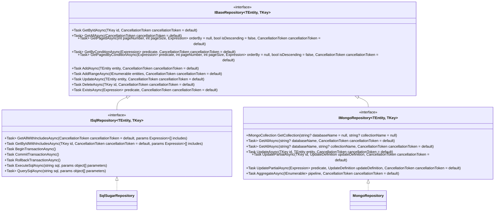

# RDB和MongoDB仓储区分方案

## 一、当前项目结构分析

### 1. 现有接口结构
- `IRepository<TEntity, TKey>`：通用仓储接口，包含CRUD操作
- `IMongoRepository<TEntity, TKey>`：MongoDB特定接口，继承自`IRepository`
- 没有专门为RDB设计的接口

### 2. 现有实现
- `SqlSugarRepository<TEntity, TKey>`：使用SqlSugar实现的RDB仓储
- `MongoRepository<TEntity, TKey>`：使用MongoDB.Driver实现的MongoDB仓储

### 3. 存在的问题
- `IRepository`接口包含RDB特有概念（如导航属性`includes`）
- MongoDB实现需要处理不必要的RDB概念
- 两种数据库的特性没有得到充分利用
- 接口层次不够清晰，扩展性差

## 二、改进方案

### 1. 接口层次设计



### 2. 接口定义

#### 2.1 基础接口 IBaseRepository
```csharp
namespace FakeMicro.DatabaseAccess.Interfaces;

public interface IBaseRepository<TEntity, TKey> where TEntity : class
{
    // 通用查询方法
    Task<TEntity?> GetByIdAsync(TKey id, CancellationToken cancellationToken = default);
    Task<IEnumerable<TEntity>> GetAllAsync(CancellationToken cancellationToken = default);
    Task<PagedResult<TEntity>> GetPagedAsync(int pageNumber, int pageSize, 
        Expression<Func<TEntity, object>>? orderBy = null, 
        bool isDescending = false,
        CancellationToken cancellationToken = default);
    Task<IEnumerable<TEntity>> GetByConditionAsync(Expression<Func<TEntity, bool>> predicate, 
        CancellationToken cancellationToken = default);
    Task<PagedResult<TEntity>> GetPagedByConditionAsync(Expression<Func<TEntity, bool>> predicate,
        int pageNumber, int pageSize,
        Expression<Func<TEntity, object>>? orderBy = null,
        bool isDescending = false,
        CancellationToken cancellationToken = default);
    
    // 通用CRUD方法
    Task AddAsync(TEntity entity, CancellationToken cancellationToken = default);
    Task AddRangeAsync(IEnumerable<TEntity> entities, CancellationToken cancellationToken = default);
    Task UpdateAsync(TEntity entity, CancellationToken cancellationToken = default);
    Task DeleteAsync(TKey id, CancellationToken cancellationToken = default);
    Task<bool> ExistsAsync(Expression<Func<TEntity, bool>> predicate, 
        CancellationToken cancellationToken = default);
}
```

#### 2.2 RDB特定接口 ISqlRepository
```csharp
namespace FakeMicro.DatabaseAccess.Interfaces;

public interface ISqlRepository<TEntity, TKey> : IBaseRepository<TEntity, TKey> where TEntity : class
{
    // RDB特有查询方法
    Task<IEnumerable<TEntity>> GetAllWithIncludesAsync(
        CancellationToken cancellationToken = default,
        params Expression<Func<TEntity, object>>[] includes);
    
    Task<TEntity?> GetByIdWithIncludesAsync(TKey id, 
        CancellationToken cancellationToken = default,
        params Expression<Func<TEntity, object>>[] includes);
    
    // 事务相关
    Task BeginTransactionAsync();
    Task CommitTransactionAsync();
    Task RollbackTransactionAsync();
    
    // 原生SQL支持
    Task ExecuteSqlAsync(string sql, params object[] parameters);
    Task<IEnumerable<T>> QuerySqlAsync<T>(string sql, params object[] parameters);
}
```

#### 2.3 MongoDB特定接口 IMongoRepository
```csharp
namespace FakeMicro.DatabaseAccess.Interfaces;

public interface IMongoRepository<TEntity, TKey> : IBaseRepository<TEntity, TKey> where TEntity : class
{
    // MongoDB特有方法
    IMongoCollection<TEntity> GetCollection(string? databaseName = null, string? collectionName = null);
    
    // 多数据库/集合支持
    Task<IEnumerable<TEntity>> GetAllAsync(string? databaseName, CancellationToken cancellationToken = default);
    Task<IEnumerable<TEntity>> GetAllAsync(string? databaseName, string? collectionName, CancellationToken cancellationToken = default);
    
    // 直接使用ID更新
    Task UpdateAsync(TKey id, TEntity entity, CancellationToken cancellationToken = default);
    
    // 部分更新支持
    Task UpdatePartialAsync(TKey id, UpdateDefinition<TEntity> updateDefinition, CancellationToken cancellationToken = default);
    Task UpdatePartialAsync(Expression<Func<TEntity, bool>> predicate, UpdateDefinition<TEntity> updateDefinition, CancellationToken cancellationToken = default);
    
    // 聚合查询支持
    Task<List<TEntity>> AggregateAsync(IEnumerable<PipelineStageDefinition<TEntity, TEntity>> pipeline, CancellationToken cancellationToken = default);
}
```

### 3. 实现类修改

#### 3.1 SqlSugarRepository
```csharp
public class SqlSugarRepository<TEntity, TKey> : ISqlRepository<TEntity, TKey> where TEntity : class
{
    // 实现ISqlRepository接口的所有方法
    // 保留现有的RDB特有功能
}
```

#### 3.2 MongoRepository
```csharp
public class MongoRepository<TEntity, TKey> : IMongoRepository<TEntity, TKey> where TEntity : class
{
    // 实现IMongoRepository接口的所有方法
    // 移除不必要的RDB概念（如includes参数）
}
```

## 三、迁移策略

1. **创建新接口**：首先创建`IBaseRepository`、`ISqlRepository`接口
2. **修改现有接口**：更新`IMongoRepository`接口，使其继承自`IBaseRepository`
3. **更新实现类**：
   - 修改`SqlSugarRepository`实现`ISqlRepository`
   - 修改`MongoRepository`实现`IMongoRepository`，移除不必要的方法
4. **更新依赖注入**：在DI容器中注册新的接口和实现
5. **更新客户端代码**：根据需要选择使用`ISqlRepository`或`IMongoRepository`

## 四、优势

1. **更清晰的职责分离**：每个接口只包含特定数据库类型的功能
2. **更好的类型安全**：客户端代码可以明确知道使用的是哪种数据库类型
3. **充分利用数据库特性**：RDB可以使用导航属性、事务等特性，MongoDB可以使用部分更新、聚合等特性
4. **更好的扩展性**：可以为每种数据库类型添加更多特有功能
5. **减少不必要的代码**：MongoDB实现不再需要处理导航属性等RDB概念

## 五、示例用法

### 1. RDB用法
```csharp
// 注入RDB仓储
private readonly ISqlRepository<User, long> _userRepository;

// 使用导航属性
var user = await _userRepository.GetByIdWithIncludesAsync(123, includes: u => u.Roles, u => u.Orders);

// 使用事务
await _userRepository.BeginTransactionAsync();
try
{
    await _userRepository.UpdateAsync(user);
    await _userRepository.CommitTransactionAsync();
}
catch
{
    await _userRepository.RollbackTransactionAsync();
    throw;
}
```

### 2. MongoDB用法
```csharp
// 注入MongoDB仓储
private readonly IMongoRepository<Product, string> _productRepository;

// 使用部分更新
var update = Builders<Product>.Update
    .Set(p => p.Price, 99.99)
    .AddToSet(p => p.Tags, "new");
await _productRepository.UpdatePartialAsync(productId, update);

// 使用多数据库支持
var products = await _productRepository.GetAllAsync(databaseName: "ProductDB");
```

## 六、总结

通过这种分层设计，我们可以更好地区分RDB和MongoDB的仓储定义和实现，充分利用每种数据库的特性，同时保持良好的扩展性和可维护性。这种设计符合接口隔离原则和单一职责原则，使代码更加清晰和易于使用。