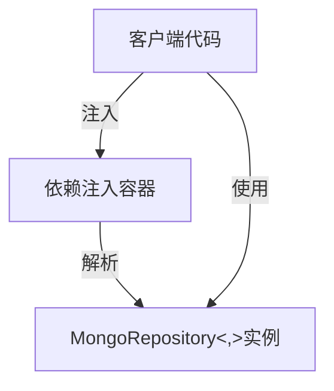
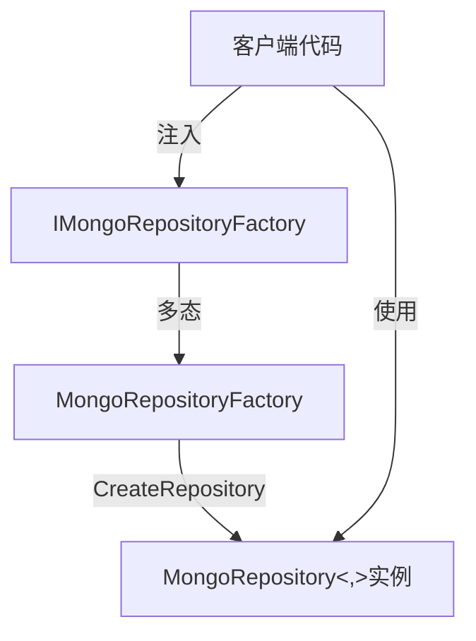
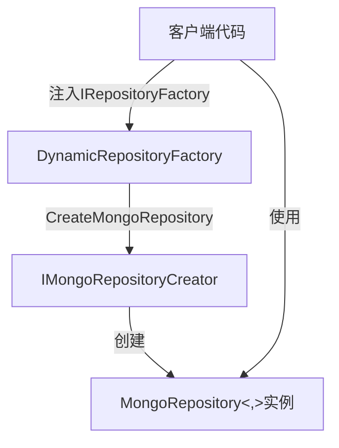

现在我已经收集了足够的信息，可以总结MongoDB仓储的相互调用关系了。# MongoDB仓储相互调用关系分析

## 核心组件结构

### 1. 仓储接口层次
```
IBaseRepository<,> (基础仓储接口)
    ↑
IMongoRepository<,> (MongoDB特定接口) ← IMongoActRepository<,> (扩展MongoDB接口)
    ↑
MongoRepository<,> (MongoDB具体实现)
```

### 2. 工厂接口层次
```
IRepositoryFactory (通用仓储工厂)
    ↑
IMongoRepositoryFactory (MongoDB特定工厂)
    ↑
MongoRepositoryFactory (MongoDB工厂实现)
    ↘
DynamicRepositoryFactory (动态仓储工厂，支持多数据库类型)
```

## 详细调用关系

### 1. 依赖注入注册流程
```mermaid
flowchart TD
    A[DatabaseServiceExtensions.AddDatabaseServices]
    B[MongoDBServiceCollectionExtensions.AddMongoDB]
    C[注册IMongoRepository<,>]
    D[注册IMongoRepositoryFactory]
    E[注册MongoClient]
    F[注册DynamicRepositoryFactory]
    
    A -->|UseMongoDB=true| B
    A -->|UseMongoDB=true| C
    A -->|RegisterDynamicRepositoryFactory=true| F
    B --> E
    B --> D
    C --> MongoRepository<,>
    D --> MongoRepositoryFactory
    F --> IRepositoryFactory
```

### 2. 仓储创建流程

#### 方式一：直接注入IMongoRepository<,>


**示例代码**：
```csharp
public class MyService
{
    private readonly IMongoRepository<Product, string> _productRepository;
    
    public MyService(IMongoRepository<Product, string> productRepository)
    {
        _productRepository = productRepository;
    }
    
    public async Task<Product> GetProductAsync(string id)
    {
        return await _productRepository.GetByIdAsync(id);
    }
}
```

#### 方式二：使用IMongoRepositoryFactory创建


**示例代码**：
```csharp
public class MyService
{
    private readonly IMongoRepositoryFactory _repositoryFactory;
    
    public MyService(IMongoRepositoryFactory repositoryFactory)
    {
        _repositoryFactory = repositoryFactory;
    }
    
    public async Task<Product> GetProductAsync(string id)
    {
        var repository = _repositoryFactory.CreateRepository<Product, string>();
        return await repository.GetByIdAsync(id);
    }
}
```

#### 方式三：使用DynamicRepositoryFactory创建


**示例代码**：
```csharp
public class MyService
{
    private readonly IRepositoryFactory _repositoryFactory;
    
    public MyService(IRepositoryFactory repositoryFactory)
    {
        _repositoryFactory = repositoryFactory;
    }
    
    public async Task<Product> GetProductAsync(string id)
    {
        var repository = _repositoryFactory.CreateMongoRepository<Product, string>();
        return await repository.GetByIdAsync(id);
    }
}
```

### 3. 分页查询调用链
```mermaid
flowchart TD
    A[客户端代码调用GetPagedAsync]
    B[继承IMongoRepository的接口实现]
    C[MongoRepository.GetPagedAsync]
    D[MongoDB.Driver.MongoCollection]
    E[返回PagedResult<T>]
    
    A -->|如：_repository.GetPagedAsync(page, pageSize)| B
    B -->|重写或直接调用| C
    C -->|使用MongoDB.Driver| D
    D -->|执行查询| C
    C -->|构造结果| E
    A -->|接收结果| E
```

**示例调用**：
```csharp
// 在Grains中的调用
var pagedResult = await _repository.GetPagedAsync(page, pageSize, x => x.CreatedAt, true, cancellationToken);
```

## 关键技术点

### 1. 接口设计原则
- **单一职责**：IMongoRepository专注于MongoDB特定操作
- **接口隔离**：避免客户端依赖不必要的方法
- **依赖倒置**：通过接口注入，不依赖具体实现

### 2. 工厂模式应用
- **专门工厂**：MongoRepositoryFactory专注于MongoDB仓储创建
- **抽象工厂**：IRepositoryFactory提供通用仓储创建接口
- **动态工厂**：DynamicRepositoryFactory支持根据数据库类型动态选择创建策略

### 3. 依赖注入最佳实践
- **注册位置**：通过MongoDBServiceCollectionExtensions和DatabaseServiceExtensions集中注册
- **生命周期**：
  - MongoClient: Singleton (全局唯一客户端实例)
  - IMongoRepository<,>: Scoped (每个请求一个实例)
  - IMongoRepositoryFactory: Scoped
  - IRepositoryFactory: Singleton

### 4. 数据库连接管理
- MongoClient通过依赖注入注册为Singleton，确保连接池高效复用
- 支持通过databaseName参数动态指定数据库
- 连接字符串从配置文件获取并验证

## 代码调用示例

### 在Grain中使用MongoDB仓储
```csharp
public class FakeNewsGrain : Grain, IFakeNewsGrain
{
    private readonly IFakeNewsRepository _repository;
    
    public FakeNewsGrain(IFakeNewsRepository repository)
    {
        _repository = repository;
    }
    
    public async Task<PagedResult<FakeNews>> GetPagedNews(int page, int pageSize, CancellationToken cancellationToken)
    {
        return await _repository.GetPagedAsync(page, pageSize, x => x.CreatedAt, true, cancellationToken);
    }
}
```

### 使用动态仓储工厂创建MongoDB仓储
```csharp
public class ProductService
{
    private readonly IRepositoryFactory _repositoryFactory;
    
    public ProductService(IRepositoryFactory repositoryFactory)
    {
        _repositoryFactory = repositoryFactory;
    }
    
    public async Task<Product> GetProductAsync(string id)
    {
        // 使用动态工厂创建MongoDB仓储
        var repository = _repositoryFactory.CreateMongoRepository<Product, string>();
        return await repository.GetByIdAsync(id);
    }
}
```

## 总结

MongoDB仓储系统通过**分层接口设计**和**工厂模式**实现了高度的灵活性和可扩展性：

1. **直接注入**：适合固定使用MongoDB的场景，代码简洁
2. **MongoDB工厂**：适合需要创建多个MongoDB仓储实例的场景
3. **动态工厂**：适合需要在运行时选择数据库类型的场景

这种设计遵循了**依赖倒置原则**和**接口隔离原则**，使系统能够轻松扩展支持新的数据库类型，同时保持客户端代码的稳定性。